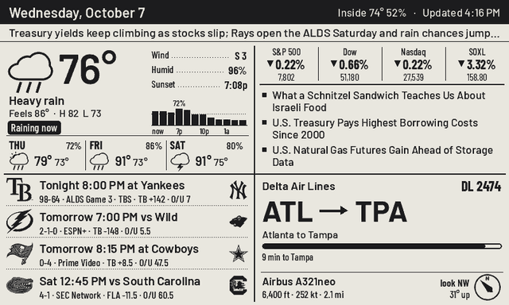
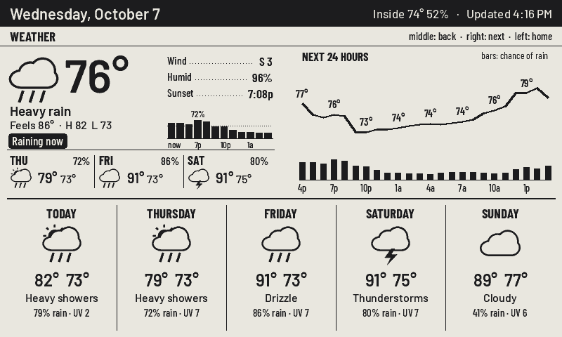
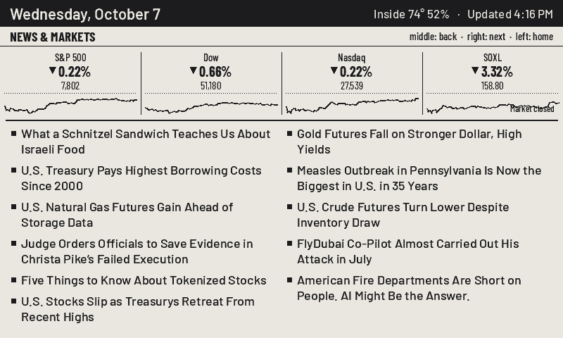
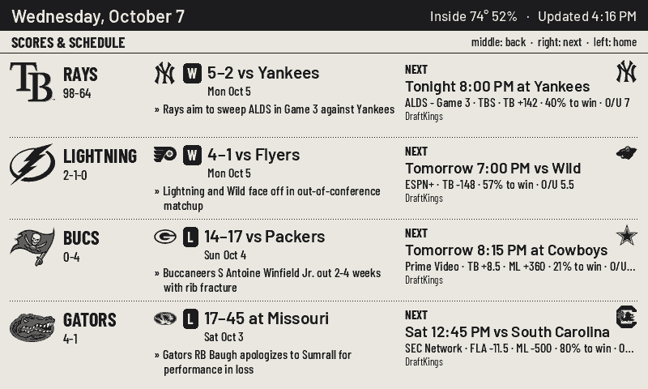
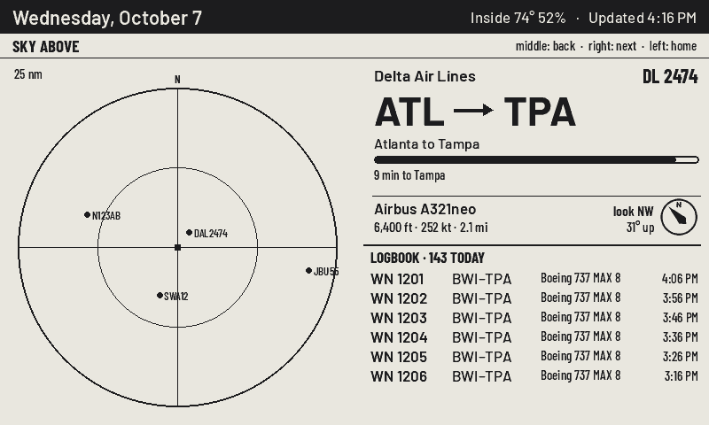

# Quad Board

An e-paper kitchen dashboard for the Seeed reTerminal E1001. Four corners of your day on a 7.5" screen: the weather, the news and markets, your teams, and whatever is flying over the house right now.



**[See the project page →](https://j-rod-ay.github.io/eink-quad/)**

## What's on it

| Corner | Shows |
|---|---|
| **Weather** | current conditions, rain chance for the next few hours, 3-day forecast, 15-minute rain nowcast, NWS alerts |
| **News & markets** | index and ticker moves, rotating WSJ headlines |
| **Your teams** | live score, last result or next game for any ESPN team, with TV and the betting line |
| **Plane overhead** | airline, route, aircraft, altitude and which way to look, from live ADS-B. An ISS pass or a visible rocket launch takes this corner over |

A strip under the header carries one line: your own pinned message, a severe weather alert, or a sentence from Claude that ties the day together (optional).

The three buttons on top work as **home**, **previous page** and **next page**. Each corner has its own detail page:

| | |
|---|---|
|  |  |
|  |  |

## How it works

The screen doesn't decide anything. A small Python server renders every pixel with Pillow, diffs the frame against what's already on the glass, and hands the board only the rectangles that changed. The board long-polls over HTTPS (or deep-sleeps between checks on battery) and plays those rectangles as ~1 s partial refreshes. A full refresh with 4 grey levels runs on the regular update, and a flashing one every couple of hours wipes ghosting.

Changing the layout, the cadence or a data source never means reflashing. Everything is a setting on the server's web dashboard.

```
server/    Python: data sources, renderer, long-poll server, settings dashboard
firmware/  PlatformIO / Arduino for the reTerminal E1001 (ESP32-S3)
docs/      the project page and screenshots
```

## Data sources

All keyless: Open-Meteo (forecast + nowcast), api.weather.gov (alerts, US only), WSJ RSS, Yahoo Finance spark, ESPN's site API, adsb.lol + adsbdb, CelesTrak + Launch Library 2. The one-line brief uses the [`claude`](https://docs.claude.com/en/docs/claude-code) CLI if it's installed and logged in. Turn `llm_brief` off otherwise.

## Setup

### Hardware
- [Seeed reTerminal E1001](https://www.seeedstudio.com/) (7.5" 800×480 mono e-paper, ESP32-S3)
- An always-on machine for the server (VPS, Raspberry Pi, NAS), reachable from the board over **HTTPS**. Put it behind nginx or Caddy. The firmware doesn't verify certificates, so a self-signed one works too.

### Server

```sh
cd server
pip install -r requirements.txt
cp quad.env.example quad.env       # set QUAD_TOKEN and QUAD_ADMIN
set -a; . ./quad.env; set +a
python app.py                      # listens on 127.0.0.1:8740
```

Open `http://127.0.0.1:8740/?k=<QUAD_ADMIN>` to set your location, units, feeds, tickers, teams, panel order and refresh cadence. Settings are saved to `config.json`.

**Preview without hardware:** `python cases.py` renders every screen with live data to `case_*.png`.

**Your teams:** the built-in keys are the Tampa ones (`bucs`, `lightning`, `rays`, `gators_fb`, `gators_bb`). Add your own in `config.json` with ESPN's sport, league and team id or abbreviation:

```json
{
  "city": "Chicago",
  "lat": 41.8781, "lon": -87.6298,
  "custom_teams": {
    "bears": ["Bears", "football", "nfl", "chi"],
    "cubs":  ["Cubs", "baseball", "mlb", "chc"]
  },
  "teams": ["bears", "cubs"]
}
```

### Firmware

```sh
cd firmware
cp src/secrets.example.h src/secrets.h   # your server's host and QUAD_TOKEN
pio run -t upload --upload-port COM9     # or upload.bat COM9 on Windows
```

On first boot the board opens a Wi-Fi setup portal named `QuadBoard-XXXX`. Join it from your phone and pick your network. To get back to it later, hold the right button and tap the left one.

`firmware/serial.ps1 -Port COM9` resets the board and prints its boot log.

## Notes

- Times use the server's `TZ` (defaults to `America/New_York`).
- The notes feature reads a separate "note box" project's database and is off unless `QUAD_NOTES_DB` is set.
- Team logos and airline logos are downloaded at runtime and cached in `server/cache/`. None are shipped in this repo.

## License

MIT. Bundled fonts carry their own licences, listed in [`server/fonts/LICENSES.md`](server/fonts/LICENSES.md).
